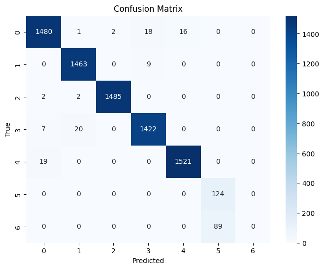
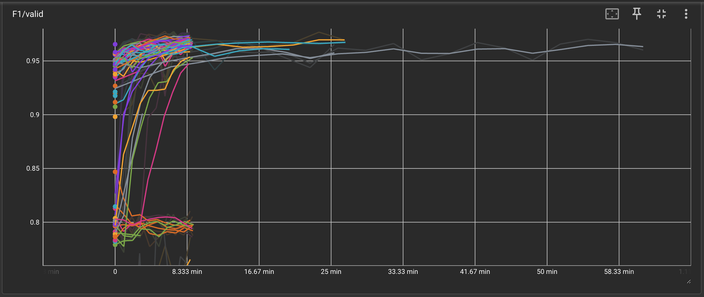
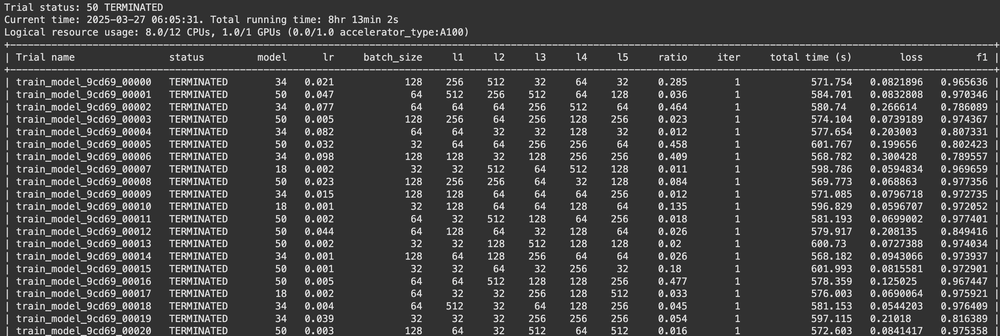
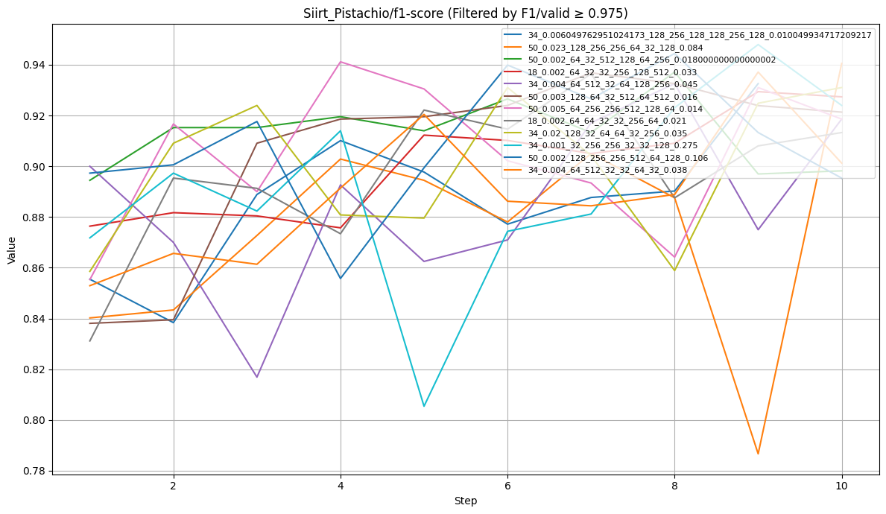
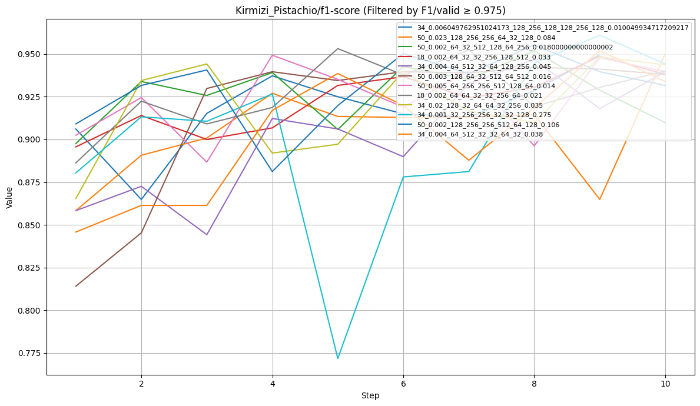
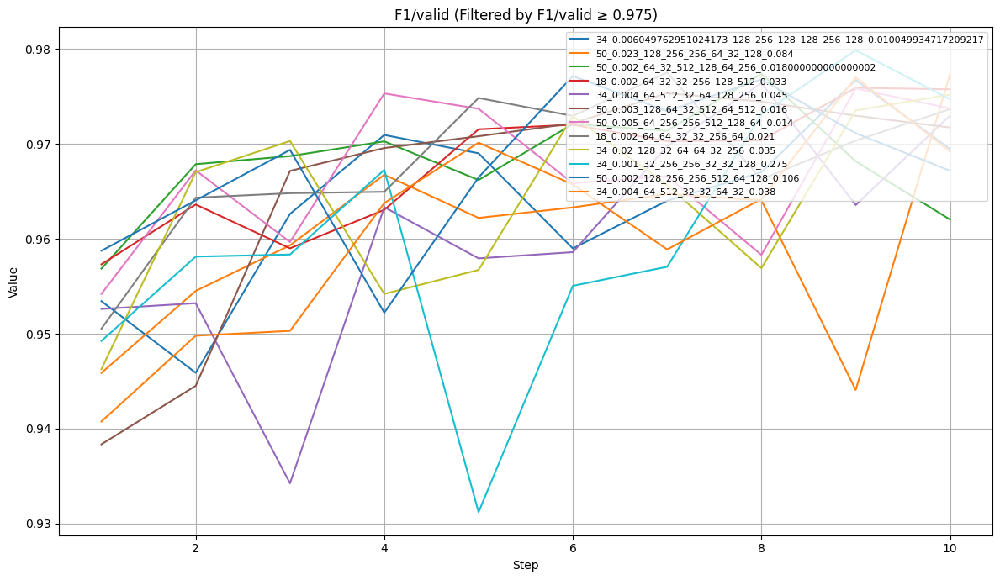
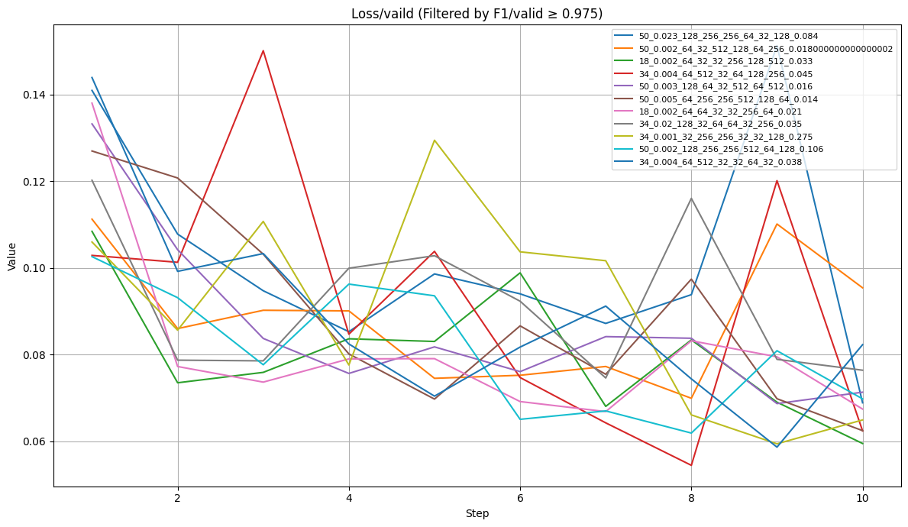
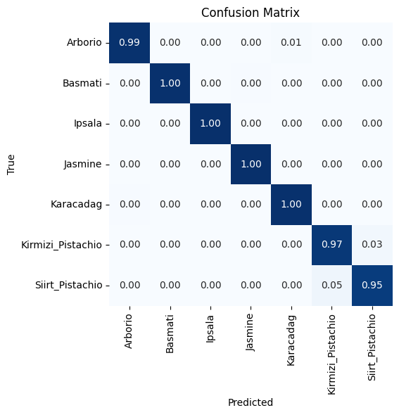
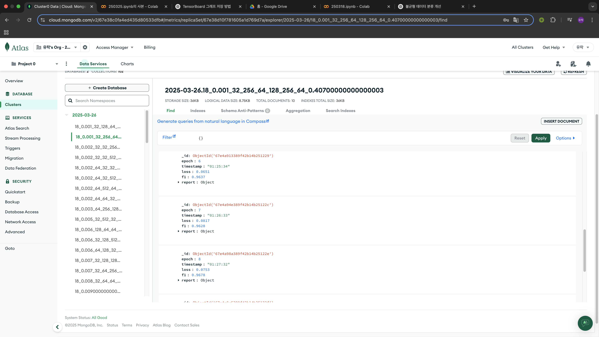

# 12-cole-express-AI


## `250318`
### 1. 문제 정의
목표: 클래스별 데이터의 개수가 불균형한 상황에서도 전체적인 분류 성능을 향상시키기 위한 훈련 방법 및 최적 모델의 구조와 하이파라미터 조합 찾기.
문제: 데이터의 불균형 문제

```python
paths.append("muratkokludataset/rice-image-dataset")
paths.append("muratkokludataset/pistachio-image-dataset")
```
데이터셋의 개수가 `rice-image-dataset` 의 경우 약 **75000개** 였으나, `pistachio-image-dataset` 의 경우 약 **2500** 개 밖에 안되면서 데이터의 불균형 발생(전체 데이터의 **0.3%** 만 차지하며 심한 데이터 불균형 상황 초래) 
실제로 아무 장치 없이 훈련을 시킬 경우 **피스타치오** 의 분류 성능이 매우 좋지 않은 것을 확인할 수 있음.


따라서 이 문제를 해결하기 위해서 **클래스 가중치와 판단 지표로 F1-Score** 를 도입함.
1. 오버샘플링
2. 언더샘플링
3. 데이터 증강
4. 클래스 가중치
5. 앙상블 기법
중에서 클래스 가중치를 적용한 이유는 **데이터 증강** 은 이미 적용. **오버샘플링/언더샘플링** 은 데이터의 지나친 수정은 원하지 않았음.
<br>**앙상블 기법** 의 경우는 모델의 추가적인 수정을 원하지 않았기 때문에 **클래스 가중치** 기법을 적용함.
<br>**파인 튜닝** 을 적용(26e6개의 파라미터 중 실제로 훈련하는 파라미터는 약 700000개.)
<br>`Resnet`을 feature extractor로 활용함으로써 추가적으로 구현한 레이어의 원활한 학습을 유도.
```
===============================================================================================
Total params: 26,248,319
Trainable params: 691,287
Non-trainable params: 25,557,032
Total mult-adds (Units.GIGABYTES): 4.09
===============================================================================================
Input size (MB): 0.60
Forward/backward pass size (MB): 177.86
Params size (MB): 104.99
Estimated Total Size (MB): 283.45
===============================================================================================
```

<br>
성능의 개선에는 성공했으나 아직 다수 데이터에 비해서 소수 데이터의 분류 정확도가 충분히 정확하지 않다는 사실을 알 수 있음.

## `250325`
추가적으로 **모델의 구조와 하이퍼파라미터 튜닝** 을 시도함.
`ray` 를 이용해서 **random search** 를 적용함으로써 최적의 값을 찾아내기 위해 시도함.

```python
class CustomResNet(nn.Module):
    def __init__(self, base_model, l1:int=512, l2:int=256, l3:int=128, l4:int=64, l5:int=32, ratio:float=0.5):
        super(CustomResNet, self).__init__()
        self.base = base_model
        out_features = self.base.fc.out_features
        self.layer5 = nn.Sequential(

            nn.BatchNorm1d(out_features),
            nn.ReLU(),

            nn.Linear(out_features, l1),
            nn.Dropout(ratio),
            nn.BatchNorm1d(l1),
            nn.ReLU(),


            nn.Linear(l1, l2),
            nn.Dropout(ratio),
            nn.BatchNorm1d(l2),
            nn.ReLU(),

            nn.Linear(l2, l3),
            nn.Dropout(ratio),
            nn.BatchNorm1d(l3),
            nn.ReLU(),

            nn.Linear(l3, l4),
            nn.Dropout(ratio),
            nn.BatchNorm1d(l4),
            nn.ReLU(),

            nn.Linear(l4, l5),
            nn.Dropout(ratio),
            nn.BatchNorm1d(l5),
            nn.ReLU(),

            nn.Linear(l5, 7),
        )

    def forward(self, x):
        x = self.base(x)
        x = self.layer5(x)
        return x    
config = {
        "model": tune.choice([
            "18", "34", "50"
                ]),
        #0.001 ~ 0.1
        "lr" : tune.qloguniform(1e-3, 1e-1, 1e-3),
        "batch_size": tune.choice([32, 64, 128]),
        "l1": tune.choice([32, 64, 128, 256, 512]),
        "l2": tune.choice([32, 64, 128, 256, 512]),
        "l3": tune.choice([32, 64, 128, 256, 512]),
        "l4": tune.choice([32, 64, 128, 256, 512]),
        "l5": tune.choice([32, 64, 128, 256, 512]),
        #0.01 ~ 0.5
        "ratio": tune.qloguniform(1e-2, 5*1e-1, 1e-3)
    }
    '''
	    config 내에서 model의 state를 전달해주는 식으로 구성했으나 
	    ray에서 trainable 객체는 pkl로 serialization을 요구하므로 tensor를 직접 집어넣을 수 없었음.
    '''
    if config["model"] == "18":
        base_model = models.resnet18(weights=models.ResNet18_Weights.IMAGENET1K_V1)
    elif config["model"] == "34":
        base_model = models.resnet34(weights=models.ResNet34_Weights.IMAGENET1K_V1)
    elif config["model"] == "50":
        base_model = models.resnet50(weights=models.ResNet50_Weights.IMAGENET1K_V1)

    for param in base_model.parameters():
        param.requires_grad = False
    model = CustomResNet(base_model=base_model, l1=config["l1"], l2=config["l2"], l3=config["l3"], l4=config["l4"], l5=config["l5"], ratio=config["ratio"])
```
`ray` 를 활용해서 가용 자원을 최대화하여 병렬 연산을 유도했으나 ray에 전달되는 trainable 객체는 serialization를 요구하므로 tensor를 직접 집어넣을 수 없었음.
간접적으로 집어넣는 방식으로 수정함.


총 50개 * 10 epoch = 500번의 시도를 통해서 최적의 모델을 찾기 위해 시도함.

의미없는 학습 시도를 중단시켜 훈련의 효율을 높이기 위해서 `AHAScheduler`를 사용함


```python
 scheculer = ASHAScheduler(
        metric="f1",
        mode="max",
        max_t=max_num_epochs,
        grace_period=1,
        reduction_factor=2
    )
```
- `metric="f1"` : 평가 기준으로 F1-score 사용
- `mode="max"` : F1-score가 **클수록** 좋다고 판단
- `max_t` : 최대 학습 epoch 수
- `grace_period=1` : 최소한 1 epoch은 학습 후 판단
- `reduction_factor=2` : 성능이 낮은 실험을 절반씩 줄여나감
의 방식으로 최적의 모델을 찾기 위해 시도했음.

### 성능평가




<br>
성능이 크게 상승한 것을 확인할 수 있다.
<br>

## `250326`
`MongoDB` 와 훈련 과정을 연결하는 것으로 목표로 했음. NOSQL에 JSON 형식으로 올리는 것이 쉬울 것이라 판단했음.
### 문제점
`ray_tune` 과 비동기적으로 훈련 지표를 전송하는 과정에서 문제가 생겨 ray_tune 코드를 변경했음. 
run() 함수로 실행할 경우 DB에 전송하는 함수가 실행이 안되는 것을 디버깅으로 확인하고 run()을 Tuner()함수로 변경함.

### run()과 Tuner()의 차이점
run()은 함수형 인터페이스 기반으로 내부에서 분산 실행되기 때문에 코드가 호출되지 않거나 실행환경이 격리되어 문제가 생김
Tuner()는 내부적으로 setup()과 step()을 통해서 로킹 코드 실행을 보장함.
